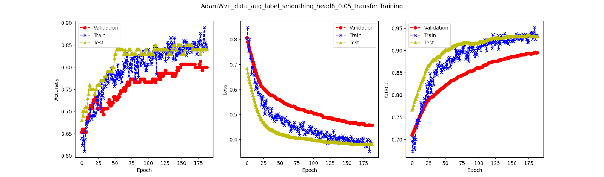

# Vision Transformer (ViT) — Image Classification Pipeline

A full PyTorch-based pipeline implementing data preprocessing, ViT from scratch, transfer learning, and evaluation for image classification tasks.

---

## Project Summary

This project implements a complete end-to-end machine learning pipeline for an image classification task using **Vision Transformer (ViT)** models. I built a full preprocessing and data-loading framework, implemented ViT **from scratch**, and explored **transfer learning** to improve model performance.

A modular **PyTorch training system** was designed with checkpointing, learning-rate scheduling, and GPU acceleration. Additionally, I developed a comprehensive **evaluation pipeline**, tuned hyperparameters based on validation statistics, and improved **test AUROC from 0.6624 → 0.9324**.

This project demonstrates practical experience in **deep learning engineering**, **model implementation**, **vision transformer architectures**, and **experiment-driven model optimization**.

---

## 📁 Repository Structure

- `dataset_challenge.py` — Dataset loading & preprocessing  
- `train_challenge.py` — Full training loop  
- `model/` — ViT & baseline model architectures  
- `train_commoncuda.py` — Core training functions (train, eval, checkpoints restore/load/store)
- `utils.py` — Shared utilities (metrics, training_curve plotting)  

---

## 📊 My Results
- **AUROC improved from 0.6624 → 0.9324**  

**Training curve wrt best test auroc**

---